# **Personal Finance Tracker**

CLI tool to record and monitor your spending.

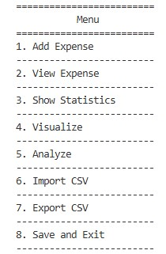

## Core Features
- **Add Expense:** Enter the amount, category, date, and an optional note.

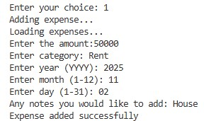

- **View Expenses:** Display all stored expenses in a clean list.  

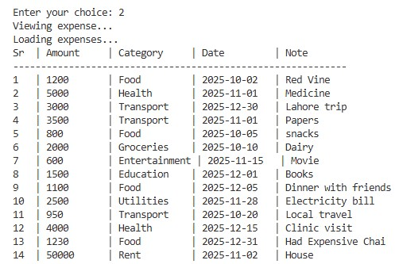

- **Show Statistics:** View basic spending stats like totals and summaries. 

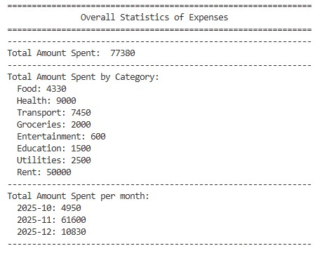 

- **Exit:** Saves everything to your JSON file before closing.

Expenses are stored in a JSON file using four main datamembers (`amount`, `category`, `date`, `note`)
and handled through the project’s core Python methods.

---

## Features (Phase 2)
- **Monthly Spending:** Automatically groups and totals expenses by month.

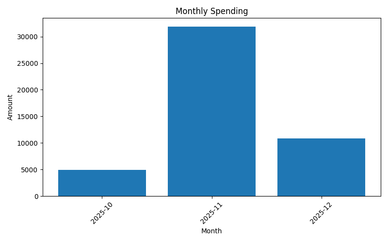

- **Category Breakdown:** Shows how much you’ve spent in each category.

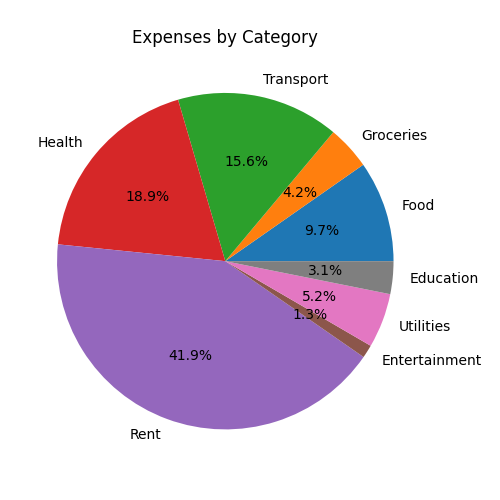  

- **Expenses Over Time:** Tracks your spending trend across dates for simple time-based analysis.  

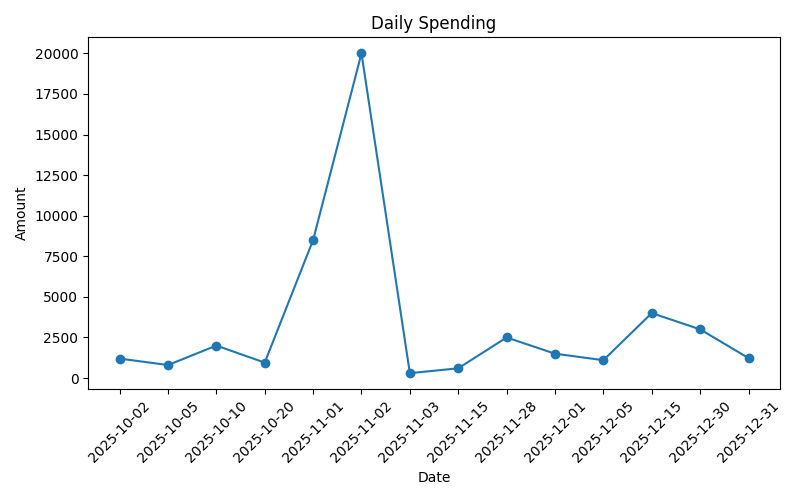

## New Features (Phase 2)
- **Monthly Spending:** Automatically groups and totals expenses by month.

- **Category Breakdown:** Shows how much you've spent in each category.

  

- **Expenses Over Time:** Tracks your spending trend across dates for simple time-based analysis.  

---

## Features (Phase 3)
- **Daily Summary:** View total spending per day with detailed breakdown.

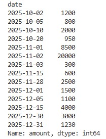 

- **Monthly Summary:** Analyze monthly spending patterns and totals.

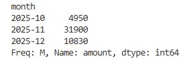 

- **Category Summary:** Get a quick overview of expenses by category.

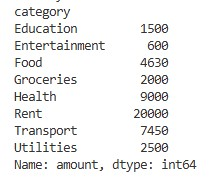 

- **Detect Trends:** Compare spending between months to identify trends.

 

- **Budget Alerts:** Set spending limits per category and get warnings when exceeded.

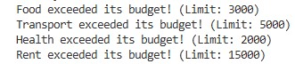 

- **CSV Import/Export:** 
  - **Export:** Save all expenses to `expenses.csv` for backup or external analysis.
  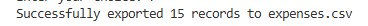 
  - **Import:** Load expenses from CSV files directly into the app.
  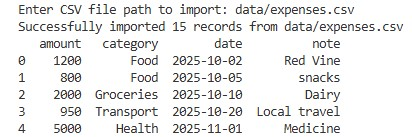 

- **Analytics Menu:** Access all analysis tools from a dedicated menu.

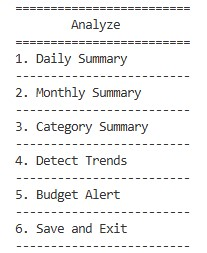 

- **Chart Visualization Menu:** Generate and save visual representations of your spending habits.

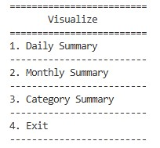 

---

## Technical Stack

- **Language:** Python 3.x
- **Data Storage:** JSON
- **Analysis:** Pandas
- **Visualization:** Matplotlib
- **Architecture:** Modular design with separate utilities, analysis, and visualization modules

